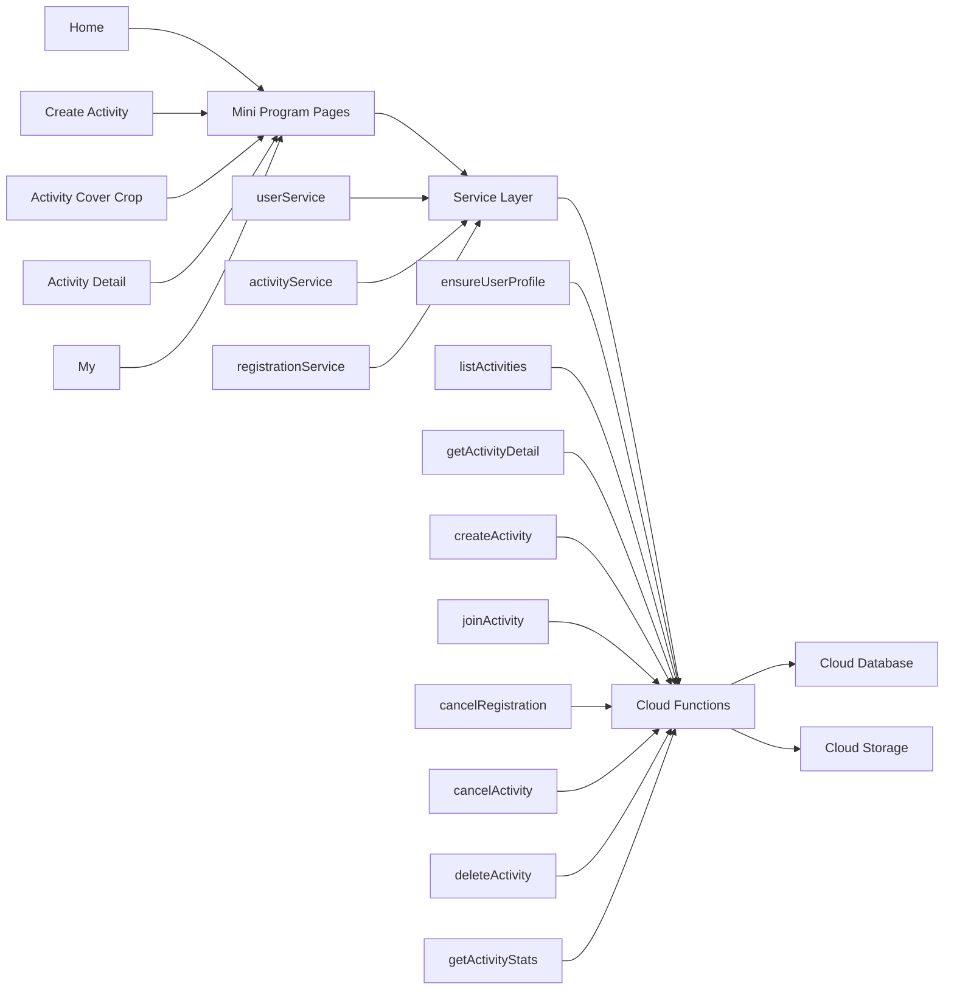

# Football Signup Mini Program MVP Design

- Date: 2026-04-19
- Status: Updated to match the current implementation on `codex/football-signup-mvp`
- Goal: launch a practical `MVP` first while preserving extension points for future `payments`, `multi-organization`, and `analytics`

## 1. Product Summary

Football Signup Assistant is a WeChat mini program for organizing football match signups. The core loop is:

1. An organizer creates an activity
2. The organizer shares the activity into a WeChat group
3. Participants open the activity detail page and join one team
4. The organizer reviews team rosters, remaining capacity, and activity status

The MVP uses `free signup + payment-ready structure`.

## 2. Current MVP Scope

### 2.1 Activity Creation

The current MVP supports the following creation fields:

- activity title
- activity date
- start time
- end time
- signup deadline date
- signup deadline time
- optional invite code
- optional insurance signup link
- total signup limit
- dynamic team configuration
- per-team capacity
- description
- one cover image
- WeChat map location selection

The activity cover image is cropped to a shared `2:1` ratio so that the same framing works on both the home card and the activity detail hero.

### 2.2 Team Setup

The current MVP uses this team model:

- the form starts with one named team by default
- the organizer can add up to four named teams
- total signup limit is independent from named-team capacity
- when total signup limit is greater than the sum of named-team capacities, the system auto-generates a bench team

Bench behavior:

- the bench team is system-generated
- the bench team is read-only on the create page
- bench capacity equals `signupLimitTotal - sum(namedTeam.maxMembers)`
- bench members are displayed like other teams on the detail page

### 2.3 Activity Detail

The detail page shows:

- cover image
- title
- location name and address text
- teams with `joined / max`
- team member list with avatar placeholder and signup name
- organizer/admin-only proxy badge for participants added on someone else's behalf
- organizer/admin move action for moving participants between teams
- optional insurance link open action when the activity has an insurance signup link
- current user signup state
- organizer action button when permitted
- signup cancel button when permitted

### 2.4 My Page

The current MVP no longer renders created and joined activities in two stacked sections.

Instead:

- `My` uses top-level tabs: `Created` and `Joined`
- the `Created` tab includes a second filter row: `All / Active / Cancelled / Deleted`
- the `Joined` tab shows only joined activities

### 2.5 Activity List Statuses

The home page and activity cards use these user-facing statuses:

- `Joinable`
- `Full`
- `Signup Closed`
- `Cancelled`
- `Deleted`

Rules:

- `Deleted` activities do not appear on Home
- `Deleted` activities do not appear in Joined history
- `Deleted` activities remain visible to their organizer inside the Created tab

## 3. Technology Choices

The MVP uses:

- Frontend: `native WeChat mini program`
- Backend: `WeChat CloudBase`
- Data storage: `CloudBase document database`
- File storage: `cloud storage` for formal deployment, with local mock support during development
- Business logic: `cloud functions`

Reasons:

- fastest path to launch for a WeChat-first product
- best fit for native sharing, login, and mini program review flow
- no need to build and operate a separate backend for the MVP
- clear service and cloud-function boundaries keep later migration practical

Code boundary rules:

- pages do not write directly to the database
- pages call only the `services/` layer
- the `services/` layer calls cloud functions
- capacity checks, deadline checks, permission checks, and duplicate prevention stay in cloud functions

## 4. Current Architecture

## 5. User Identity and Signup Strategy

### 5.1 No Separate Registration Page

The MVP does not require a dedicated registration flow before activity signup.

Design decision:

- users do not register first; they sign up first
- the backend automatically creates or updates the user profile

### 5.2 `openid` Is the Stable User Identity

The unique user identity is the WeChat mini program `openid`.

Important notes:

- `openid` cannot be derived from signup name, phone number, avatar, or nickname
- `openid` is obtained through the WeChat mini program identity chain
- in CloudBase, cloud function runtime context provides the current user `OPENID`

### 5.3 User Profile Creation Rules

When a user first opens the app or an activity page:

1. the cloud function reads the current user's `openid`
2. it queries the `users` collection by that value
3. if a record exists, it updates `lastActiveAt`
4. if no record exists, it creates the user automatically

To prevent duplicate user profiles:

- `users._id = openid`

### 5.4 Signup Name Rules

The MVP does not rely on WeChat nickname as the signup display name.

Design decision:

- `signupName` is entered manually during signup
- the signup page may prefill `signupName` from `users.preferredName`
- users may still edit `signupName` per activity so the roster can use the name teammates recognize
- the user profile may update `preferredName` from the user's chosen nickname or latest signup name
- roster display prioritizes the activity-specific `signupName`

### 5.5 Profile Nickname and Avatar Rules

The app must not assume it can silently read a user's WeChat nickname or avatar.

Design decision:

- the first signup flow can offer a lightweight profile area
- nickname is collected through user input, preferably with `input type="nickname"` as a WeChat-assisted shortcut
- avatar is collected only after the user taps an avatar picker, preferably `button open-type="chooseAvatar"`
- avatar selection is optional and must not block signup
- selected avatars should upload to CloudBase storage in real-cloud mode and save the resulting file ID to `users.avatarUrl`
- subsequent signup flows should prefill from `users.preferredName` and `users.avatarUrl`
- `registrations.signupName` remains the activity-specific roster name, while `users.preferredName` and `users.avatarUrl` are reusable profile defaults

### 5.6 Phone Number Rules

The active MVP signup flow does not collect participant phone numbers.

Design decision:

- activities are stored with `requirePhone = false`
- Create/Edit Activity does not expose a phone requirement control
- Join Activity does not render phone input or WeChat phone authorization
- registration records created by the current UI do not store `phoneSnapshot`
- `joinActivity` may store optional phone fields when a future flow deliberately sends them
- phone fields remain compatible and do not require immediate migration

## 6. Core Business Rules

### 6.1 Signup Deadline

The MVP now uses an explicit signup deadline instead of relying on activity start time alone.

Rules:

- signup deadline is entered as `date + time`
- `signupDeadlineAt` must be earlier than or equal to `startAt`
- new signups are blocked after the deadline
- signup cancellation is also blocked after the deadline

### 6.2 One Active Signup Per User Per Activity

Rules:

- a user can hold only one active signup in the same activity
- after a user joins one team, all team join buttons become disabled
- the user must cancel first before joining again

### 6.3 Organizer Cancellation and Soft Delete

Rules:

- the organizer can cancel a published activity
- cancelled activities remain visible and become non-joinable
- the organizer can delete only an empty activity
- delete is implemented as `soft delete`
- soft-deleted activities stay visible in the organizer's Created history

### 6.4 Sharing and Permissions

Rules:

- participants can open a shared detail page
- only the organizer sees `Cancel Activity`
- only a joined participant whose deadline has not passed sees `Cancel Signup`

## 7. Core Business Flows

### 7.1 Organizer Creates an Activity

1. the organizer fills the create form
2. the organizer may choose a map location
3. the organizer uploads one cover image
4. the app opens the cover crop page
5. the organizer confirms the final `2:1` framing
6. the frontend calls `createActivity`
7. the cloud function creates the activity and teams
8. if needed, the cloud function auto-generates the bench team
9. the app redirects to activity detail

### 7.2 User Opens an Activity Page

1. the user opens the activity from a share card or list
2. the page calls `ensureUserProfile`
3. the backend finds or creates the user profile
4. the page calls `getActivityDetail`
5. the backend returns:
   - activity data
   - team list
   - member list
   - the current user's registration
   - viewer permission flags

### 7.3 User Signs Up

1. the user taps the signup button for a team
2. the app opens the signup sheet and shows the target team name
3. the user enters `signupName`
4. the user may optionally choose an avatar
5. the frontend calls `joinActivity`
6. the backend validates:
   - activity status
   - signup deadline
   - total capacity
   - team capacity
   - duplicate signup
7. the backend writes the registration and updates counters

### 7.4 User Cancels Signup

1. the user taps `Cancel Signup`
2. the frontend calls `cancelRegistration`
3. the backend validates:
   - the user has an active signup
   - the activity is still published
   - the signup deadline has not passed
4. the backend updates the registration to `cancelled`
5. the backend decrements activity and team counters

### 7.5 Organizer Cancels or Deletes an Activity

1. the organizer taps `Cancel Activity` to stop new signups
2. the backend changes status to `cancelled`
3. if the activity has `joinedCount = 0`, the organizer may tap `Delete`
4. the backend changes status to `deleted`

## 8. Data Model

### 8.1 `users`

Purpose: store the user master profile

Key fields:

- `_id`: `openid`
- `preferredName`: reusable signup/profile display name
- `wechatNickname`: reserved
- `avatarUrl`: user-selected avatar file ID or empty
- `roles`
- `createdAt`
- `lastActiveAt`

### 8.2 `activities`

Purpose: activity master table

Key fields:

- `title`
- `organizerOpenId`
- `orgId`: reserved
- `startAt`
- `endAt`
- `signupDeadlineAt`
- `addressText`
- `addressName`
- `location`
- `description`
- `coverImage`: CloudBase file ID in real-cloud mode, local temporary path in local mock mode
- `coverThumbImage`: smaller CloudBase file ID used by list/card rendering
- `imageList`: future-ready image list; currently stores the same single cover image
- `insuranceLink`: optional external insurance signup link opened from Activity Detail through a mini program `web-view`
- `signupLimitTotal`
- `joinedCount`
- `requirePhone`: legacy field, stored as `false`
- `inviteCode`
- `feeMode`
- `feeAmount`: reserved
- `status`: `draft/published/closed/finished/cancelled/deleted`
- `createdAt`
- `updatedAt`

### 8.3 `activity_teams`

Purpose: team table under each activity

Key fields:

- `_id`
- `activityId`
- `teamName`
- `sort`
- `maxMembers`
- `joinedCount`
- `teamType`: `regular/bench`
- `autoGenerated`
- `status`
- `createdAt`

### 8.4 `registrations`

Purpose: activity signup records

Key fields:

- `_id`: `activityId_openid`
- `activityId`
- `teamId`
- `userOpenId`
- `status`: `joined/cancelled`
- `signupName`
- `source`: `share/direct`
- `movedByOpenId`: latest organizer/admin who moved the participant between teams
- `movedAt`: latest move timestamp
- `payStatus`: reserved
- `orderId`: reserved
- `proxyRegistration`: true when an organizer/admin added the participant on someone else's behalf
- `createdByOpenId`: organizer/admin openid for proxy registrations
- `joinedAt`
- `cancelledAt`
- `updatedAt`

### 8.5 `activity_logs`

Purpose: operational logs and analytics foundation

Key fields:

- `activityId`
- `operatorOpenId`
- `action`
- `payload`
- `createdAt`

## 9. Cloud Functions

The current MVP uses these main cloud functions:

- `ensureUserProfile`
- `listActivities`
- `getActivityDetail`
- `createActivity`
- `updateActivity`
- `joinActivity`
- `addProxyRegistration`
- `cancelRegistration`
- `removeRegistration`
- `moveRegistration`
- `cancelActivity`
- `deleteActivity`
- `getActivityStats`

## 10. Permissions

| Action | Participant | Organizer of This Activity | Other Logged-In User |
| --- | --- | --- | --- |
| View Home list | allow | allow | allow |
| View published activity detail | allow | allow | allow |
| View deleted activity detail | deny | allow | deny |
| Join one team | allow for self | allow for self | allow for self |
| Cancel own signup before deadline | allow for self | allow for self | allow for self |
| Add proxy participant | deny | allow | deny |
| Remove participant | deny | allow | deny |
| Move participant to another team | deny | allow | deny |
| Copy participant names | deny | allow | deny |
| See proxy participant badge | deny | allow | deny |
| Cancel activity | deny | allow | deny |
| Soft delete empty activity | deny | allow | deny |
| View organizer stats | deny | allow | deny |

## 11. Extension Points

The MVP still reserves room for:

- WeChat Pay and refunds
- organizer-managed team reassignment
- restore-from-delete flow
- richer analytics and dashboards
- multi-organization admin
- multi-image activity galleries
- optional signup profile completion and user-facing identity display for admin authorization
- gesture-based image cropping

## 12. MVP Summary

The current MVP decisions are:

- use `native WeChat mini program + WeChat CloudBase`
- create user profiles automatically with `openid`
- use manual `signupName` entry
- allow optional user-selected nickname/avatar profile defaults for signup prefill
- do not collect participant phone numbers in the active signup flow
- enforce one active signup per user per activity
- enforce signup deadline for both joining and cancellation
- support dynamic teams plus an auto-generated bench team
- support an optional insurance signup link on activities
- support organizer cancellation and soft deletion
- use a `2:1` cover image crop shared across list and detail surfaces
- use a tabbed `My` page with Created and Joined history
