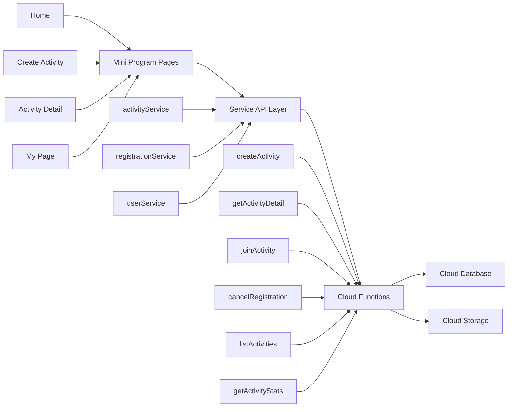

# Football Signup Mini Program MVP Design

- Date: 2026-04-19
- Status: Pending review
- Goal: launch an `MVP` first while preserving clean extension points for future `payments`, `multi-activity / multi-organization`, and `analytics`

## 1. Background and Goals

Football Signup Assistant is a WeChat mini program for organizing football match signups. The core loop is:

1. An organizer creates an activity
2. The organizer shares the activity into a WeChat group
3. Participants open the activity page and sign up
4. The organizer reviews team rosters and remaining capacity

The MVP priority is speed to launch, so the product will use `free signup + payment-ready structure`.

The MVP must support:

- Activity creation: title, time, address, description, cover image, total capacity, team setup, and per-team capacity
- Activity sharing: a shareable activity detail page entry for WeChat groups
- Participant signup: users open the activity page, pick a team, and sign up
- Participant cancellation: users can cancel before the activity starts
- Organizer roster view: the organizer can see members per team and remaining spots
- Basic stats: total joined count, per-team counts, and cancellation count

The MVP will not implement these features yet, but must reserve room for them:

- WeChat Pay and refunds
- Waitlists
- Multi-organization admin
- Advanced analytics and reporting
- Auto-balancing teams and points systems

## 2. Technology Choices

The MVP will use:

- Frontend: `native WeChat mini program`
- Backend: `WeChat CloudBase`
- Data storage: `CloudBase document database`
- File storage: `cloud storage`
- Business logic: `cloud functions`

Reasons:

- Fastest path to launch for a WeChat-first product
- Best fit for native sharing, login, and mini program review flow
- No need to build a separate backend, gateway, or ops stack first
- A thin `service/api` layer plus domain-based cloud function boundaries will keep future migration to a self-hosted backend practical

Code boundary rules:

- Pages must not write directly to the database
- Pages call only the `service` layer
- The `service` layer calls cloud functions
- Capacity checks, permission checks, and concurrency handling must live in cloud functions only

## 3. Overall Architecture

## 4. Pages and MVP Scope

### 4.1 Home Page

Display:

- activity list
- activity status: joinable, full, ended
- quick entries: create activity, join activity

### 4.2 Create Activity Page

Fields:

- activity title
- start date
- start time
- end time
- address
- activity description
- cover image
- total signup limit
- team configuration
- per-team signup limit
- whether phone number is required
- optional invite code

Rules:

- at least 1 team is required; the MVP supports 1 to 4 teams
- total signup limit must be greater than 0
- per-team limit must be greater than 0
- if phone number is required, signup must complete phone authorization or manual input

### 4.3 Activity Detail Page

Display:

- basic activity info
- list of teams
- joined count and capacity for each team
- current user's signup state
- buttons for signup, cancel, and share

### 4.4 My Page

Display:

- activities I created
- activities I joined
- basic user profile entry

## 5. User Identity and Signup Strategy

This section is the core outcome of the current design update.

### 5.1 No Separate Registration Page

The MVP does not require users to complete a dedicated registration flow before signing up for an activity.

When a user enters an activity page, the system will bootstrap the user profile automatically based on WeChat identity.

Design decision:

- users do not register first; they sign up first
- the backend automatically creates or updates the user profile

### 5.2 `openid` Is the Only Stable User Identity

The unique user identity in this system is not the signup name and not the phone number. It is the WeChat mini program `openid`.

Important notes:

- `openid` cannot be derived from signup name, phone number, avatar, or nickname
- `openid` can only be obtained through the WeChat login chain
- in CloudBase, cloud function runtime context provides the current user `OPENID`

### 5.3 User Profile Creation Rules

When a user first opens an activity page or attempts signup:

1. the cloud function reads the current user's `openid`
2. it queries the `users` collection by that `openid`
3. if a record exists, it returns the existing user profile
4. if no record exists, it creates one automatically

To make duplicate profile creation impossible by design:

- `users._id = openid`

This means the same WeChat user will never create duplicate user profiles, even if the person later changes signup name, nickname, or phone number.

### 5.4 Signup Name Rules

The MVP does not rely on WeChat nickname as the signup display name.

Reasons:

- WeChat avatar and nickname rules have changed, so real nickname is not a stable source
- football scenarios often use field aliases or group nicknames rather than legal names
- historical activity rosters must preserve the exact name entered at signup time

Design decision:

- `signupName` is manually entered at signup time and is required
- the user profile may store `preferredName`
- after signup, the system may update `preferredName` with the latest entered signup name
- roster display should prioritize the current activity's `signupName`

### 5.5 Phone Number Rules

The MVP does not require phone number collection by default, but organizers can enable it per activity.

Recommended strategy:

- activities default to `requirePhone = false`
- if the organizer enables the phone requirement, the signup flow shows a phone input step
- the product should prefer `one-tap phone retrieval`
- the product should keep `manual input` as a fallback

Implementation constraints:

- phone retrieval must be triggered by an explicit user action
- phone number capability should only be used when there is a real business need
- the signup record stores an activity-specific `phoneSnapshot`

### 5.6 Avatar and Nickname Rules

The MVP does not treat "retrieve WeChat avatar and nickname" as a prerequisite for signup.

If a profile page is added later, the app can adopt WeChat's current recommended avatar picker and nickname input capabilities, but they should not block the MVP signup path.

## 6. Core Business Flows

### 6.1 User Opens an Activity Page

1. the user opens the activity from a share card
2. the page calls `ensureUserProfile`
3. the cloud function gets the current `openid` from runtime context
4. if no user profile exists, it creates one automatically
5. it returns the user profile and the user's signup state for the activity

### 6.2 User Signs Up

1. the user taps the signup button for a specific team
2. the app opens a signup confirmation sheet
3. the user enters a signup name
4. if the activity requires a phone number, the user completes phone retrieval or manual input
5. the frontend calls `joinActivity`
6. the cloud function validates activity status, total capacity, team capacity, and duplicate signup
7. it inserts or updates the signup record
8. it updates the activity and team joined counts

### 6.3 User Cancels Signup

1. the user taps cancel signup
2. the frontend calls `cancelRegistration`
3. the cloud function changes signup status to `cancelled`
4. it updates the activity and team counters

### 6.4 Organizer Creates an Activity

1. the organizer fills the activity form
2. the frontend calls `createActivity`
3. the cloud function creates the activity document
4. the cloud function creates team documents in batch
5. it returns the activity ID for detail page redirect and sharing

## 7. Data Model

The MVP should start with at least the following 5 collections.

### 7.1 `users`

Purpose: store the user master profile

Key fields:

- `_id`: `openid`
- `preferredName`: most recently used signup name
- `wechatNickname`: reserved field
- `avatarUrl`: reserved field
- `phone`: latest user-level phone number, optional
- `roles`: `["user"]` or `["user", "organizer"]`
- `createdAt`
- `lastActiveAt`

Design principle:

- the user master profile stores current primary information only
- historical signup names should not be overwritten as if they were the sole truth

### 7.2 `activities`

Purpose: activity master table

Key fields:

- `title`
- `organizerOpenId`
- `orgId`: reserved
- `startAt`
- `endAt`
- `addressText`
- `location`: coordinates, reserved
- `description`
- `coverImage`
- `signupLimitTotal`
- `joinedCount`
- `requirePhone`
- `inviteCode`
- `feeMode`: default `free`
- `feeAmount`: reserved
- `status`: `draft/published/closed/finished/cancelled`
- `createdAt`
- `updatedAt`

### 7.3 `activity_teams`

Purpose: team table under each activity

Key fields:

- `_id`
- `activityId`
- `teamName`
- `sort`
- `maxMembers`
- `joinedCount`
- `status`
- `createdAt`

Design principle:

- teams must be stored in their own collection, not embedded directly into the activity document
- this makes future waitlists, auto-assignment, and team analytics easier

### 7.4 `registrations`

Purpose: activity signup records

Key fields:

- `_id`: recommended format `activityId_openid`
- `activityId`
- `teamId`
- `userOpenId`
- `status`: `joined/cancelled`
- `signupName`
- `phoneSnapshot`
- `source`: `share/direct`
- `payStatus`: reserved
- `orderId`: reserved
- `joinedAt`
- `cancelledAt`
- `updatedAt`

Design principle:

- one user should keep only 1 primary signup record per activity
- cancellation does not delete the record; it updates status instead
- rejoining the same activity updates the same record

This avoids:

- duplicate active signup records for the same activity
- confusing analytics between "duplicate signup" and "rejoin"

### 7.5 `activity_logs`

Purpose: operational logs and analytics foundation

Key fields:

- `activityId`
- `operatorOpenId`
- `action`: `create_activity/join_activity/cancel_registration/update_activity`
- `payload`
- `createdAt`

Design principle:

- log key actions from day one of the MVP
- provide a foundation for conversion, activity, and debugging analytics later

## 8. Duplicate Prevention and Concurrency Strategy

### 8.1 Prevent Duplicate User Profiles

Rule:

- `users._id = openid`

Result:

- the same WeChat user cannot create duplicate user profiles

### 8.2 Prevent Duplicate Activity Signup

Rule:

- `registrations._id = activityId_openid`

Result:

- the same user can only have one primary signup record per activity

### 8.3 Capacity Consistency

`joinActivity` and `cancelRegistration` must execute only in cloud functions.

Server-side flow:

- read activity status
- read current team counts
- read current user's registration
- execute all writes inside a transaction

Recommended transaction scope in CloudBase:

- update `registrations`
- update `activities.joinedCount`
- update `activity_teams.joinedCount`

If a transaction conflicts or capacity is exhausted, the function must return a clear business error.

## 9. Cloud Function Design

Cloud functions should be split by business domain.

### 9.1 `ensureUserProfile`

Responsibilities:

- get current `openid`
- find or create the user profile
- update `lastActiveAt`

### 9.2 `createActivity`

Responsibilities:

- validate payload
- create activity master record
- create team records
- write creation log

### 9.3 `updateActivity`

Responsibilities:

- update activity fields
- update team configuration
- write update log

### 9.4 `listActivities`

Responsibilities:

- home page activity list
- my created activities
- my joined activities

### 9.5 `getActivityDetail`

Responsibilities:

- return activity detail
- return team list
- return current user's signup status and selected team

### 9.6 `joinActivity`

Responsibilities:

- validate whether the activity is joinable
- validate whether total capacity is full
- validate whether target team is full
- validate whether an active signup already exists
- insert or update the signup record
- update joined counters
- write activity log

### 9.7 `cancelRegistration`

Responsibilities:

- validate that the current user has an active signup
- update status to cancelled
- update joined counters
- write activity log

### 9.8 `getActivityStats`

Responsibilities:

- aggregate total joined users
- aggregate team counts
- aggregate cancellation count

## 10. Permissions and Security Rules

MVP permission rules:

- regular users can act only on their own profile and their own registrations
- only the activity creator can modify the activity
- only the activity creator can view organizer-facing stats
- direct database writes should be locked down as much as possible; critical writes go through cloud functions only

Sensitive data principles:

- collect phone numbers only under the principle of minimum necessity
- do not collect unrelated personal data during signup
- do not rely on deprecated WeChat avatar/nickname authorization paths

## 11. Extension Points for the Formal Version

### 11.1 Payment Capability

Reserved fields already included:

- `activities.feeMode`
- `activities.feeAmount`
- `registrations.payStatus`
- `registrations.orderId`

Likely future collections:

- `orders`
- `refunds`
- `payment_logs`

### 11.2 Multi-Activity and Multi-Organization

Reserved field already included:

- `activities.orgId`

Likely future expansion:

- one organization with multiple admins
- multiple activities grouped under one organization space
- organization-level dashboards

### 11.3 Analytics

Current foundation:

- `activity_logs`
- `registrations.status`
- `activities.joinedCount`

Likely future metrics:

- view-to-signup conversion rate
- weekly activities created
- active organizer count
- repeat signup rate
- signup peaks by time window

## 12. MVP Scope Summary

The key decisions for this MVP are:

- use `native WeChat mini program + WeChat CloudBase`
- users do not register first; the system auto-creates profiles using `openid`
- users manually enter a `signupName` when joining
- phone number is not collected by default; organizers enable it per activity if needed
- user deduplication relies on `openid`
- per-activity signup deduplication relies on `activityId + openid`
- capacity and concurrency validation run inside cloud function transactions
- the data model reserves extension fields from day one for payments, multi-organization support, and analytics

This design optimizes for:

- fast MVP launch
- low-friction signup flow
- extensibility without rewriting the system later
